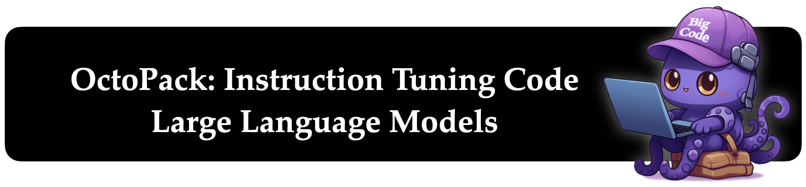

# OctoPack: Instruction Tuning Code Large Language Models



This repository provides an overview of all components from the paper OctoPack: Instruction Tuning Code Large Language Models.

<!-- TOC -->

- [OctoPack: Instruction Tuning Code Large Language Models](#octopack-instruction-tuning-code-large-language-models)
    - [Data](#data)
        - [CommitPack](#commitpack)
        - [CommitPackFT](#commitpackft)
            - [Other](#other)
    - [Evaluation](#evaluation)
        - [Creation](#creation)
        - [Run](#run)
    - [Training](#training)
        - [Transformers](#transformers)
        - [Megatron-LM](#megatron-lm)
            - [Checkpoint conversion](#checkpoint-conversion)
            - [Other](#other)
    - [Citation](#citation)
- [TODO](#todo)
                - [Logo](#logo)

<!-- /TOC -->

## Data

### CommitPack

1. **BigQuery SQL:** Use BigQuery to select the commit data from the GitHub action data. All SQL commands can be found in `dataset/commitpack/sql`. They are executed in order starting with the first one to to the fifth one. They are separated and executed one-by-one as BigQuery was raising `Resources exceeded` errors during query execution when running all in a single statement. After each SQL query a dataset is created and named as indicated in the filename. E.g. after executing `sql_1_commits_table_base.sql`, you would name the output dataset `commits_table_base`, which is then referenced in the 2nd statement.
2. **Export:** From BigQuery export the dataset after the final SQL statement inside GCP to a bucket as parquet files. 
3. **Upload to HF:** Use a GCP compute instance to copy all the parquet files into a Hugging Face dataset and push it. The resulting dataset contains metadata on the commits, [CommitPackMeta](https://huggingface.co/datasets/bigcode/commitpackmeta)
4. **Scrape GitHub:**

### CommitPackFT

1. **Prepare:** Download CommitPack or follow all its steps to recreate it
2. **Filter:** Run `python dataset/commitpackft/commitpackft/filter_small.py`

#### Other

- StarCoder Self-Instruct: See [this repository](https://github.com/ArmelRandy/Self-instruct)
- OASST:
- xP3x:

## Evaluation

### Creation

1. We use the upper commented out part of the script at `evaluation/create/prepare_humaneval.py` to create a JSON with the solution for each humaneval language in `evaluation/create/humaneval-x/data`. 
2. We then manually go through each JSON file (e.g. `evaluation/create/humaneval-x/data/cpp/data/humanevalpack.json`) to introduce a bug across all languages in parallel. 
3. We also make several fixes to the humaneval-x dataset, all of which are documented at the top of `evaluation/create/humaneval-x/README.md`.
4. We run the lower part of `evaluation/create/prepare_humaneval.py` to turn the JSON files back into JSONL files with the buggy solution, an instruction column and some other metadata. These JSONL files located at e.g. `evaluation/create/humaneval-x/data/cpp/data/humanevalpack.jsonl` are then uploaded into the HF dataset at https://huggingface.co/datasets/bigcode/humanevalpack.

### Run

1. **Setup:** Run the below bash code to setup the evaluation repository. If you want the repository in exactly the state we used it for the paper you can add the the flag `-b parity` to clone the branch we used for the paper. Generally, we recommend using the latest version of the code.
```bash
git clone https://github.com/bigcode-project/bigcode-evaluation-harness
cd bigcode-evaluation-harness
pip install -q -r requirements.txt
accelerate config
```
2. **Run:**
3. **Evaluate:** After running the generations you can use the notebook at `evaluation/run/humanevalpack_evaluation` or [this colab](https://colab.research.google.com/drive/1tlpGcDPdKKMDqDS0Ihwh2vR_MGlzAPC_?usp=sharing) to evaluate the generations. It installs the necessary programming languages.


## Training

### Transformers

TODO: Integrate QL's repo

### Megatron-LM

We did not end up using Megatron-LM fine-tuning for the model in the paper, but implemented it nevertheless. Feel free to follow these instructions to use it:

1. Get the StarCoderBase Megatron-LM checkpoint: `git clone https://huggingface.co/bigcode/starcoderbase-megatron`
2. Get Megatron-LM: `git clone -b mtf https://github.com/bigcode-project/Megatron-LM`
3. Prepare a Python environment with PyTorch. (TODO: There may be some other packages needed that you will find out about when training fails)
4. Prepare dataset: Preapre a finetuning dataset in the form of a single jsonl file with two keys: `inputs` & `outputs`. `inputs` should contain the prompt and instruction while `outputs` contains the targets. Loss will only be computed over `outputs`. See `dataset/commits_to_jsonl.py` for an example of doing this. In that example we put the instruction (commit message) in the target, but it's better to put it in the input.
5. Tokenize the fine-tuning dataset by modifying `dataset/preprocess.sh` to point to your jsonl dataset. Also modify the path of the tokenizer, in our case point to the StarCoder's `tokenizer.json` (`wget https://huggingface.co/bigcode/starcoderbase/raw/main/tokenizer.json`). Finally specify an output prefix where the tokenized data will be stored. Then run it with `bash dataset/preprocess.sh`.
6. Create two files `train_data_paths.txt.tmp` and `valid_data_paths.txt.tmp` that contain the paths to the above created tokenized dataset. For example they could look like `"train: 1.0 0:0.95 output_prefix"` and `"valid: 1.0 0.95:1.0 output_prefix`. In this case the dataset is split into 95% training and 5% validation. The first number is the weight of the dataset, the second number is the start of the dataset and the third number is the end of the dataset.
7. Rename the checkpoint downloaded to `release` i.e. `mv starcoderbase-megatron/iter* starcoderbase-megatron/release` and create a file `starcoderbase-megatron/latest_checkpointed_iteration.txt` that contains simply `release` (`echo release > starcoderbase-megatron/latest_checkpointed_iteration.txt`).
8. Modify `training/finetune_starcoderbase.sh` to adapt `CHECKPOINT_PATH` to point to the downloaded Megatron-LM checkpoint, `WEIGHTS_TRAIN` & `WEIGHTS_VALID` to point to the above created txt files, `TOKENIZER_FILE` to StarCoder's `tokenizer.json`, point to your environment and cache locations, and modify the SBATCH settings to suit your setup. Then run it with `bash training/finetune_starcoderbase.sh`. You can interrupt and resume training, however, if you resume, you need to remove `--no_load_optim` and `--no_load_rng` from the command line arguments in the script to load the optimizer and random number generator state from the newly saved checkpoint (we only do not want to load them from starcoderbase).
9. Convert the saved checkpoint using the instructions below.

#### Checkpoint conversion

1. Update the paths in `convert_large.sh` & download the marked repos & run it

#### Other

```python
# pip install -q transformers
import torch
from transformers import AutoModelForCausalLM, AutoTokenizer

checkpoint = "/gpfsscratch/rech/ajs/commun/Bigcode-large-megatron_conv/base/shard"
checkpoint = "/gpfsscratch/rech/ajs/commun/Bigcode-large-megatron_conv/base3/"
device = "cuda" # for GPU usage or "cpu" for CPU usage

tokenizer = AutoTokenizer.from_pretrained(checkpoint)
model = AutoModelForCausalLM.from_pretrained(
    checkpoint, 
    trust_remote_code=True,
    torch_dtype=torch.bfloat16,
    low_cpu_mem_usage=True,
).to(device)

inputs = tokenizer.encode("def print_hello_world():", return_tensors="pt").to(device)
outputs = model.generate(inputs, max_new_tokens=1)
print(tokenizer.decode(outputs[0]))
```

## Citation

TODO
